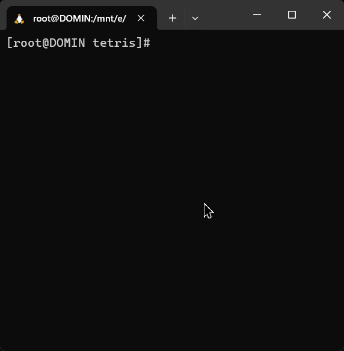

<p align="center">
  
</p>

# Tetris!

This is a small implementation of terminal-based tetris game written in C using ncurses.h library.

# Controls

The controls are typical of Tetris:

- <kbd>←</kbd> & <kbd>→</kbd> - moves the tetromino horizontally;
- <kbd>↑</kbd> - rotate the tetromino;
- <kbd>↓</kbd> - fast drop tetromino;
- <kbd>Space</kbd> - immediately drop tetromino;
- <kbd>Q</kbd> - exit the game, without saving the score;
- <kbd>P</kbd> - pause the game (press again to resume).

# Installation

> [!NOTE]
> Executables, compiled using [GitHub Actions](./.github/workflows/build-release.yml) are accessible via [Releases](https://github.com/domin-mnd/tetris/releases) tab.

If you want to compile the project using source code, here are following prerequisites required:

- ncurses: `pacman -S ncurses` / `apt install libncurses-dev`
- just: `pacman -S just` / `apt install just`

To compile the project run `just install`, it would compile the project and output `tetris` file:

```sh
$ just install
gcc -Wall -Wextra -Werror -std=c11 -D_POSIX_C_SOURCE=199309L -O3 -Isrc/include src/tetris.c src/main.c -o tetris -lncurses
$ ./tetris
```

# Credits

This tetris implementation is <a href="https://choosealicense.com/licenses/mit/">MIT licensed</a> 💖
